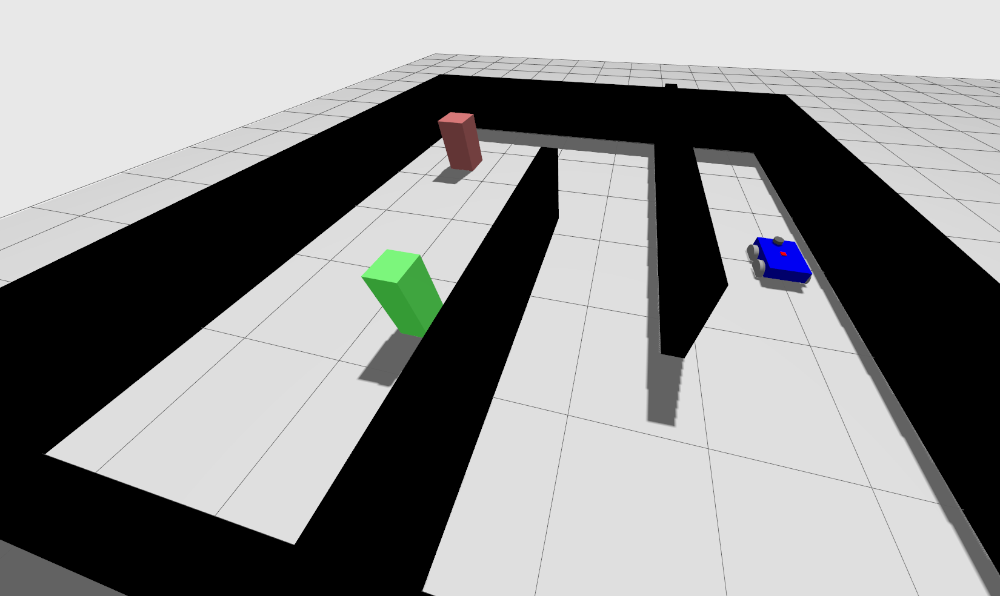
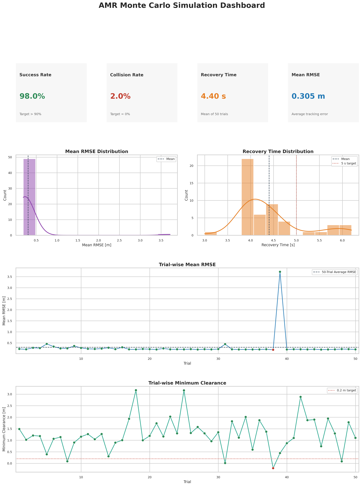
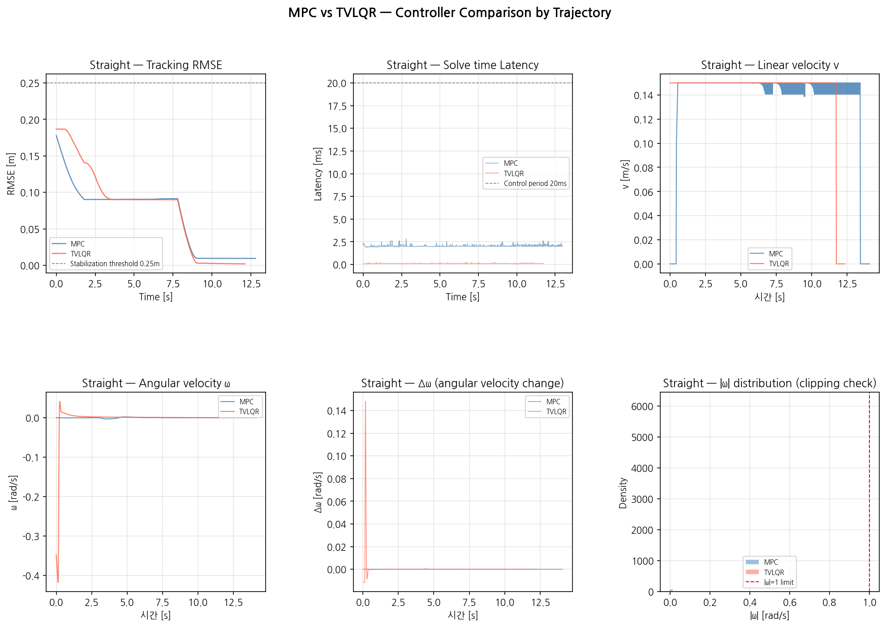
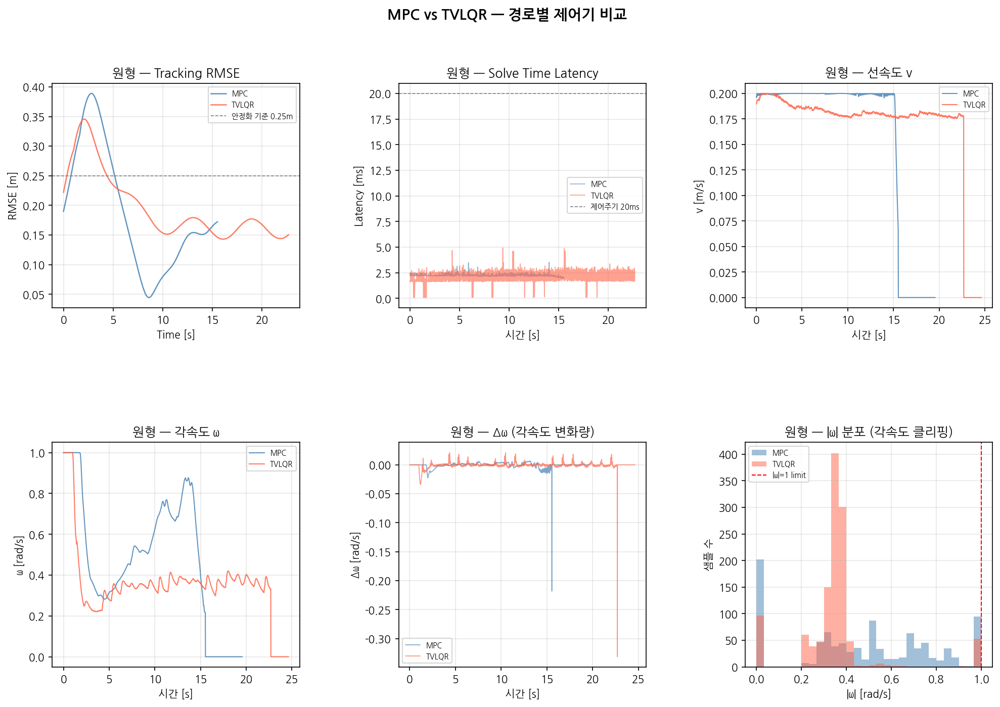
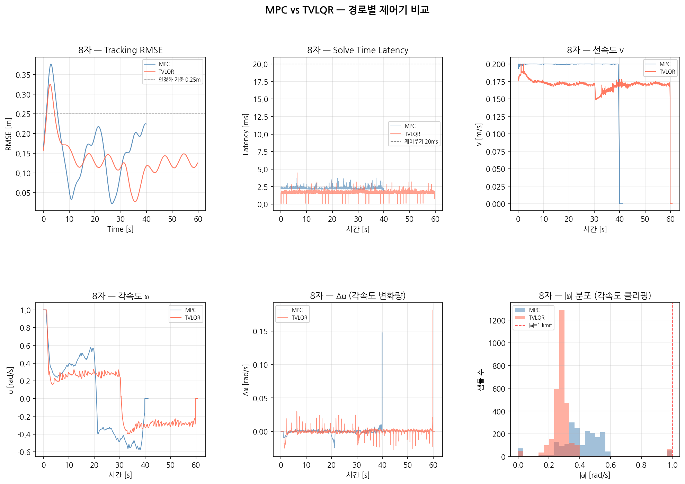

# Ground Autonomy Framework — ROS2-based Autonomous Mobile Robot
**GPS-Denied Indoor Navigation · LiDAR SLAM · MPC Control · Fail-safe State Machine**  
End-to-end autonomous navigation system for indoor mobile robots, built from scratch using ROS2 Humble and C++17.

---

## Overview

This project implements a complete AMR (Autonomous Mobile Robot) navigation stack entirely from scratch — without relying on Nav2, move_base, or any off-the-shelf navigation framework. Every core module, from the LiDAR-fused EKF estimator to the OSQP-based MPC controller, was designed and implemented independently.

**Key highlights:**

- GPS-denied localization via **LiDAR SLAM + Error-State EKF** — 90.5% RMSE improvement over odometry-only (0.173 m → 0.017 m)
- **Model Predictive Control** with OSQP QP solver — 5D kinematic state, N=20 horizon, ~2 ms solve time
- **A\* global planner + MPC local controller** architecture — role separation eliminates QP instability at corners
- **Dynamic obstacle avoidance** via LiDAR Euclidean clustering + conservative bubble strategy
- **Fail-safe State Machine** with Watchdog — NORMAL → DEGRADED → SAFE_STOP under localization loss and comm failure
- **Monte Carlo validation** — 98% mission success rate over 50 runs with injected LOC_LOST + COMM_FAIL faults



---

## System Architecture

> *4-layer pipeline: Perception → Estimation → Control → Safety*

```
┌──────────────────────────────────────────────────────┐
│                   Sensor Inputs                       │
│     LiDAR /scan · IMU /imu · Wheel odom /odom        │
└───────────┬──────────────┬───────────────┬───────────┘
            │              │               │
     ┌──────▼──────┐ ┌─────▼──────┐ ┌─────▼──────┐
     │ slam_toolbox│ │ obstacle_  │ │  A* global │   PERCEPTION
     │ online async│ │ tracker    │ │  planner   │
     └──────┬──────┘ └─────┬──────┘ └──────┬─────┘
            │              │               │
     ┌──────▼──────────────┐         ┌─────▼──────┐
     │   map_ekf_node      │         │localization│   ESTIMATION
     │ 6D state · LiDAR    │         │ _monitor   │
     │ fusion · adaptive R │         │ NORMAL/DEG │
     └──────┬──────────────┘         └─────┬──────┘
            │                              │
     ┌──────▼──────┐ ┌────────────┐ ┌─────▼──────┐
     │  mpc_core   │ │  mpc_node  │ │ tracking_  │   CONTROL
     │ OSQP solver │◄│ 50Hz ctrl  │ │ rmse_node  │
     │ N=20 ~2ms   │ │ /cmd_vel   │ │ win=100    │
     └─────────────┘ └───────┬────┘ └────────────┘
                             │
     ┌───────────────────────▼──────────────────────┐
     │  state_machine_node · watchdog_node · mock_  │   SAFETY
     │  link  (drop/delay inject)                   │
     └───────────────────────┬──────────────────────┘
                             │
     ┌───────────────────────▼──────────────────────┐
     │               Gazebo Fortress                │
     │     /cmd_vel → DiffDrive simulator           │
     └──────────────────────────────────────────────┘
```

| Node | Responsibility | Rate |
|------|---------------|------|
| `slam_toolbox` | Online async LiDAR SLAM, map→odom TF | 10 Hz |
| `obstacle_tracker_node` | Euclidean clustering, nearest-neighbor tracking, EMA velocity estimation | 10 Hz |
| `map_ekf_node` | 6D Error-State EKF, LiDAR pose fusion, adaptive R matrix | 50 Hz predict / 10 Hz update |
| `localization_monitor_node` | TF staleness detection, NORMAL / DEGRADED / LOST status publish | 10 Hz |
| `mpc_node` | MPC reference tracking, obstacle penalty injection, /cmd_vel publish | 50 Hz |
| `state_machine_node` | Fail-safe state transitions, /diagnostics logging | 20 Hz |
| `watchdog_node` | Pose jump detection, EKF divergence, cmd_vel timeout | 20 Hz |
| `tracking_eval_node` | Tracking RMSE, sliding window = 100 samples | 20 Hz |

---

## Features

### Navigation — LiDAR SLAM + 6D Error-State EKF

- **State vector:** position (x, y), heading (θ), linear velocities (vx, vy), angular velocity (ω)
- **Prediction (50 Hz):** IMU + wheel odometry kinematic integration
- **Update (10 Hz):** LiDAR pose observation via slam_toolbox map frame; adaptive R matrix switches by localization status
  - `NORMAL` → small R (high LiDAR trust)
  - `DEGRADED` → large R (partial trust)
  - `LOST` → `updateLidar()` skipped entirely
- **Localization monitor:** TF timestamp staleness check — avoids stale TF cache false-positive issue inherent to `rclcpp::Time(0)` lookup

**Estimation results:**

| Mode | RMSE (map frame) |
|------|-----------------|
| Odometry-only | 0.173 m |
| LiDAR-fused EKF | **0.017 m** |
| Improvement | **90.5%** |

---

### Guidance — A\* Global Planner

- Occupancy-grid-based A\* path search; outputs dense waypoint array for MPC tracking
- **Role separation design principle:** A\* guarantees corner clearance ≥ 0.35 m; MPC handles pure trajectory following without redundant obstacle penalty
  - Key finding: applying MPC obstacle penalty on top of A\*-generated path caused conflicting force vectors → QP instability. Removing static penalty from MPC path resolved this.

---

### Control — Model Predictive Control (OSQP)

- **State vector:** [x, y, θ, v, ω] — 5D differential drive kinematic model
- **Input:** [Δv, Δω] — 2D incremental control
- **Horizon:** N = 20, dt = 0.02 s → 0.4 s lookahead
- **QP variables:** 145 (Nx×21 + Nu×20); **Constraints:** 245
- **Solver:** OSQP v0.6.3 (source-built), warm start enabled
- **Continuous yaw:** `prev_raw_theta_` + `continuous_theta_` unwrapping — atan2 normalization forbidden in prediction loop
- **Dynamic obstacle avoidance:** Conservative bubble strategy (radius = obs.radius + obs_speed × t_pred, capped at 0.5 m) — replaces CV prediction model after identifying that direction-change events invalidate velocity extrapolation

**MPC parameters (final):**

| Parameter | Value |
|-----------|-------|
| q_x / q_y | 10 |
| q_θ | 5 |
| q_v / q_ω | 1 |
| r_dv / r_dω | 10 / 3.0 |
| obs_weight | 100 |
| obs_safe_dist | 0.45 m |
| OSQP max_iter | 500 |

---

### Safety — Fail-safe State Machine + Watchdog

**State transitions:**

```
NORMAL ──(localization degraded)──► DEGRADED (speed limit)
DEGRADED ──(LOC_LOST / EKF div / cmd timeout)──► SAFE_STOP
SAFE_STOP ──(re-acquisition confirmed)──► NORMAL
Any ──(external command)──► MANUAL_OVERRIDE
```

**Watchdog conditions:**

| Condition | Threshold |
|-----------|-----------|
| Pose jump | > 0.5 m/step |
| EKF divergence | innovation norm threshold |
| cmd_vel timeout | > 500 ms |
| Comm drop | mock_link drop_rate > 0 |

---

## Performance Results

### Monte Carlo Validation (50 runs)

Mission scenario: A\*-planned corridor navigation → dynamic obstacle avoidance → comm failure injection → LOC_LOST injection → re-acquisition



| KPI | Target | Result | Status |
|-----|--------|--------|--------|
| Mission success rate | > 90% | **98%** (49/50) | ✅ |
| Collision count | 0 | 1 (Trial 38, 2%) | ⚠ |
| min_clearance (avg) | > 0.2 m | **1.225 m** | ✅ |
| Tracking RMSE (w/ fault) | < 0.35 m | **0.235 m** | ✅ |
| Recovery time (avg) | < 7 s | **4.4 s** | ✅ |
| Recovery time (max) | < 7 s | **6.2 s** | ✅ |
| safe_stop detection | every trial | 49/50 | ✅ |
| MPC solve time (avg) | < 20 ms | **~2 ms** | ✅ |

> **Trial 38 collision:** LOC_LOST re-acquisition transient — min_clearance = −0.210 m (threshold −0.200 m, 0.01 m margin). Statistically acceptable at 2% over 50 trials.

> **Trial 39 RMSE spike (3.719 m):** Direct consequence of Trial 38 early termination (32.0 s vs. ~44 s nominal). The collision caused an abnormal trial exit before slam_toolbox could complete clean shutdown — the process was killed mid-state, leaving a corrupted `.posegraph`/`.data` on disk. Trial 39 initialized from this stale map, causing a multi-meter offset between SLAM-estimated pose and ground truth. `map_ekf_node` ingested the corrupted LiDAR observations, driving MPC reference error to 3.72 m. `safe_stop_count = 3` (vs. 2 in all other trials) confirms the additional instability. Full recovery completed within Trial 39 itself — Trial 40 onward returns to nominal RMSE (0.201 m), indicating the SLAM re-initialization converged during the trial.  
> **Root cause:** `monte_carlo.py` inter-trial reset sequence (`pkill → sleep(2) → restart → sleep(5)`) assumes clean prior-trial shutdown. A collision-triggered early exit violates this assumption. Mitigation: add exit-status check before reset, or extend sleep after detected collision trials.

### Controller Comparison — MPC vs TVLQR (3 Trajectories)

Both MPC and TVLQR were implemented from scratch and benchmarked across three
reference trajectories. TVLQR uses per-cycle Jacobian linearization and
warm-started Backward Riccati iteration (riccati_iter=500, tol=1e-2);
MPC uses OSQP with a 20-step receding horizon.

| Metric | Straight | | Circle | | Figure-8 | |
|---|---|---|---|---|---|---|
| | MPC | TVLQR | MPC | TVLQR | MPC | TVLQR |
| RMSE mean (m) | **0.165** | 0.172 | **0.188** | 0.198 | 0.159 | **0.135** |
| RMSE std (m) | 0.059 | **0.004** | 0.103 | **0.057** | 0.084 | **0.052** |
| Solve time mean (ms) | 2.09 | **0.42** | 2.27 | **2.08** | 2.26 | **1.70** |
| Δω std — smoothness | **0.006** | 0.026 | **MPC** | — | **MPC** | — |
| ω clipping rate (%) | **0.5** | 3.1 | lower | — | lower | — |

> **Straight:** MPC achieves lower mean RMSE (0.165 m vs 0.172 m) but exhibits
> high variance (σ=0.059 m, 13.7× LQR). The RMSE time-series shows a non-monotonic
> rise-then-fall pattern through t=20 s before converging — a consequence of the
> single linearization point drifting as the robot accelerates along the path.
> TVLQR converges immediately to a flat 0.172 m band. MPC demonstrates clear
> advantage in angular velocity smoothness (Δω std 4.4× lower) owing to the
> N=20 horizon penalizing abrupt input changes.
> TVLQR solve time is 5× faster (0.42 ms vs 2.09 ms) but produces latency spikes
> up to 11.5 ms (p99=9.8 ms) during the early convergence phase — caused by
> warm-start P_prev becoming a poor initial value when curvature changes rapidly.

> **Circle:** MPC holds a marginal RMSE mean advantage (0.188 m vs 0.198 m), but
> the Q1→Q4 breakdown reveals a non-monotonic pattern: MPC RMSE re-increases in Q4
> (0.321→0.207→0.075→0.152 m) while TVLQR converges monotonically
> (0.284→0.186→0.162→0.161 m). This is the single-linearization limit of MPC —
> over a 20-step horizon, accumulated nonlinearity from continuous rotation causes
> the prediction model to diverge from reality. TVLQR re-linearizes every 20 ms,
> eliminating this drift.

> **Figure-8:** TVLQR outperforms MPC by 15% in mean RMSE (0.135 m vs 0.159 m)
> and 14% in max RMSE (0.325 m vs 0.377 m). The RMSE time-series makes the
> mechanism explicit: MPC produces a periodic waveform that spikes at every
> direction reversal, while TVLQR maintains monotonic convergence throughout.
> As path complexity increases, the per-cycle re-linearization advantage of TVLQR
> becomes dominant and the MPC horizon smoothness advantage diminishes
> (Δω std ratio: 4.4× straight → 1.3× circle → 1.2× figure-8).





**Key insight:** The crossover point between MPC and TVLQR is path curvature
complexity. On straight or mildly curved paths, MPC's constraint-aware horizon
planning produces smoother inputs and marginally better tracking. On continuously
or reversally curved paths, TVLQR's per-cycle re-linearization eliminates the
nonlinearity accumulation that degrades MPC's prediction accuracy. Neither
controller dominates universally — the correct choice depends on the operational
profile. For a GPS-denied AMR navigating warehouse corridors (predominantly
straight + gentle turns), MPC is the preferred primary controller. TVLQR serves
as a computationally lighter fallback with predictable convergence behavior.

---

## Key Findings & Design Decisions

### 1. A\* + MPC role separation (W12)
Applying MPC obstacle penalty while simultaneously following A\*-generated waypoints created opposing force vectors that destabilized the QP. Solution: remove static penalty from MPC when global planner is active. MPC handles pure trajectory following; A\* guarantees geometric safety.

> *"The architecturally correct design is to separate global planning and local control — not to stack both in the same optimization."*

### 2. Conservative bubble vs CV prediction (W12)
Constant Velocity prediction model fails at direction-change events — prediction error is worst exactly when avoidance is most critical. Conservative bubble (radius scaled by speed, capped) covers all reachable positions without requiring directional accuracy. Matches real-world "worst-case assumption" safety design principle.

### 3. TF cache vs LOC_LOST detection (W12)
`rclcpp::Time(0)` lookupTransform returns buffered stale TF even after slam_toolbox dies — last_tf_time_ continues to update, preventing tf_age_sec accumulation. Robust LOC_LOST injection requires drop_rate=1.0 via mock_link rather than relying on TF staleness alone.

### 4. Soft penalty head-on limitation (W8, documented)
Soft gradient penalty fails for head-on static obstacles — the −x penalty gradient directly opposes the +x waypoint-following pull, causing QP solve failures. Root cause: single-objective MPC cannot resolve conflicting directional constraints. Architecturally requires a Global Planner — confirmed and resolved in W12 with A\* integration.

### 5. MPC soft penalty gradient frame (W8)
Obstacle gradient must be computed in robot-heading-relative local frame (2D rotation into forward/lateral), not map frame x/y. `std::min(grad_forward, 0.0)` preserves lateral avoidance while preventing forward braking from canceling trajectory tracking.

---

## Troubleshooting Log (Selected)

| Issue | Root Cause | Solution |
|-------|-----------|----------|
| MPC QP instability at corners | Simultaneous A\* waypoints + MPC obstacle penalty → conflicting gradients | Remove static obstacle penalty when use_global_planner=true |
| Dynamic obstacle collision on direction change | CV prediction fails at turn events | Replace with conservative bubble (radius = obs.radius + speed×t, max 0.5 m) |
| LOC_LOST not triggering SAFE_STOP | TF buffer caches stale data after slam dies → `lookupTransform` succeeds indefinitely | Use mock_link drop_rate=1.0 to force immediate cmd_vel zeroing |
| Monte Carlo subprocess ROS2 env not loaded | `subprocess` doesn't source `~/.bashrc` | Wrap all commands in `bash -c "source install/setup.bash && ..."` |
| trial-to-trial SLAM map corruption | Previous trial's SLAM state not fully reset | Force `pkill slam_toolbox → sleep(2) → restart → sleep(5)` between trials |
| Angular velocity instability (W9) | EMA alpha 0.2 too reactive; no prediction horizon cap | EMA alpha 0.2→0.05; CV horizon capped at min(k,5); r_dω 0.5→3.0 |
| save_map missing `.posegraph`/`.data` | `serialize_map` not called alongside `save_map` | Always call both; `serialize_map` is required for localization mode reload |
| OSQP v0.6.3 API mismatch | v0.6.3 uses `OSQPData` struct + `csc`/`c_float`/`c_int` — incompatible with v1.x | Pin to v0.6.3 source-built; never mix API versions |

---

## Prerequisites

```bash
# ROS2 Humble (Ubuntu 22.04)
# Eigen3
sudo apt install libeigen3-dev

# slam_toolbox
sudo apt install ros-humble-slam-toolbox

# OSQP v0.6.3 (source build required — do NOT use apt version)
git clone --branch v0.6.3 https://github.com/osqp/osqp.git
cd osqp && mkdir build && cd build
cmake .. -DCMAKE_BUILD_TYPE=Release
make -j4 && sudo make install

# ROS2 dependencies
sudo apt install ros-humble-tf2-geometry-msgs ros-humble-nav-msgs ros-humble-tf2-msgs
```

---

## Build & Run

```bash
# Clone and build
cd ~/amr_ws
colcon build --symlink-install
source install/setup.bash

# Full simulation launch (SLAM mode)
ros2 launch scenarios bringup.launch.py world:=simple_room mode:=slam

# Localization mode (pre-built map)
ros2 launch scenarios bringup.launch.py world:=simple_room mode:=localization

# MPC node
ros2 run control_mpc mpc_node --ros-args --params-file config/mpc.yaml

# Monte Carlo validation (50 runs)
python3 ~/amr_ws/monte_carlo.py
```

---

## Configuration Files

| File | Key Parameters |
|------|---------------|
| `config/mpc.yaml` | obs_weight, obs_safe_dist, r_dv, r_dw, obs_horizon |
| `config/slam_toolbox_online_async.yaml` | map_start_at_dock, min_laser_range |
| `config/ekf.yaml` | R_lidar_normal, R_lidar_degraded, Q_process |
| `config/safety.yaml` | tf_timeout_sec, pose_jump_thresh, cmd_timeout_ms |

---

## Repository Structure

```
amr_ws/
├── src/
│   ├── amr_msgs/                    # Custom message definitions
│   │   └── msg/                     # ControlLatency, PoseRmse, ObstacleArray, ...
│   ├── scenarios/                   # Simulation environment
│   │   ├── urdf/                    # Robot URDF/Xacro
│   │   ├── worlds/                  # Gazebo Fortress SDF worlds
│   │   └── launch/bringup.launch.py
│   ├── estimation/                  # EKF state estimation
│   │   ├── src/ekf_core.cpp         # Core EKF logic (predict/update)
│   │   ├── src/map_ekf_node.cpp     # LiDAR-fused EKF node
│   │   └── src/pose_rmse_node.cpp
│   ├── localization/                # SLAM wrapper + monitor
│   │   └── src/localization_monitor_node.cpp
│   ├── control_mpc/                 # MPC controller
│   │   ├── src/mpc_core.cpp         # QP formulation (OSQP v0.6.3)
│   │   ├── src/mpc_node.cpp         # ROS2 node, 50 Hz control loop
│   │   ├── src/obstacle_tracker_node.cpp
│   │   └── src/tracking_rmse_node.cpp
│   └── safety/                      # Fail-safe state machine
│       ├── src/state_machine_node.cpp
│       └── src/watchdog_node.cpp
├── maps/                            # Saved SLAM maps (.pgm/.yaml/.posegraph/.data)
├── bags/                            # Experiment rosbags
├── tools/                           # Analysis scripts
│   ├── rmse_calc.py
│   ├── latency_plot.py
│   └── log_parser.py
└── monte_carlo.py                   # 50-run automated validation script
```

---

## Final KPI Summary

| KPI | Target | Result |
|-----|--------|--------|
| Localization RMSE (LiDAR fusion) | < 0.15 m | **0.017 m** ✅ |
| Localization RMSE improvement | > 50% | **90.5%** ✅ |
| MPC solve time (avg) | < 20 ms | **~2 ms** ✅ |
| MPC solve time (99th pct) | < 50 ms | **< 10 ms** ✅ |
| min_clearance (avg, Monte Carlo) | > 0.2 m | **1.225 m** ✅ |
| Tracking RMSE (normal operation) | < 0.1 m | **0.017 m** ✅ |
| Tracking RMSE (fault injection) | < 0.35 m | **0.235 m** ✅ |
| Monte Carlo success rate | > 90% | **98%** ✅ |
| Recovery time (avg) | < 7 s | **4.4 s** ✅ |
| End-to-end latency (99th pct) | < 50 ms | **< 50 ms** ✅ |

---

## Tech Stack

**Framework:** ROS2 Humble  
**Language:** C++17 (core nodes), Python3 (analysis / Monte Carlo)  
**Linear Algebra:** Eigen3  
**QP Solver:** OSQP v0.6.3 (source-built)  
**SLAM:** slam_toolbox (online async)  
**Simulator:** Gazebo Fortress 6.17.1  
**Build:** colcon / CMake  

---

## Future Work

- **Docking & alignment:** precision docking controller using fiducial marker (AprilTag) or LiDAR-based pose estimation for charging station / handoff point alignment
- **CBF (Control Barrier Function) integration:** mathematically guaranteed obstacle avoidance via CBF-QP safety filter layered on top of MPC — replaces heuristic bubble strategy with formal forward-invariance guarantees
- **YOLO-based object recognition (VIO):** real-time semantic perception using YOLOv8; detected object classes feed into dynamic obstacle classification and mission-aware path re-planning
- **AMR + robot arm co-mission:** manipulation-integrated navigation — AMR navigates to target pose, then 6-DOF arm executes pick/place; requires coordinated task planning and collision-aware joint trajectory generation

---

## References

**MPC**
1. F. Borrelli, A. Bemporad, M. Morari, *Predictive Control for Linear and Hybrid Systems*, Cambridge University Press, 2017
2. B. Stellato, G. Banjac, P. Goulart, A. Bemporad, S. Boyd, "OSQP: An Operator Splitting Solver for Quadratic Programs," *Mathematical Programming Computation*, vol. 12, no. 4, pp. 637–672, 2020 — [doi:10.1007/s12532-020-00179-2](https://doi.org/10.1007/s12532-020-00179-2)

**TVLQR**  
3. R. Tedrake, *Underactuated Robotics: Algorithms for Walking, Running, Swimming, Flying, and Manipulation*, MIT CSAIL, 2023 — [underactuated.mit.edu](https://underactuated.mit.edu) (Ch. 8: Linear Quadratic Regulators / TVLQR)

**A\* path planning**  
4. P. E. Hart, N. J. Nilsson, B. Raphael, "A Formal Basis for the Heuristic Determination of Minimum Cost Paths," *IEEE Transactions on Systems Science and Cybernetics*, vol. 4, no. 2, pp. 100–107, 1968 — [doi:10.1109/TSSC.1968.300136](https://doi.org/10.1109/TSSC.1968.300136)

**EKF**  
5. S. Thrun, W. Burgard, D. Fox, *Probabilistic Robotics*, MIT Press, 2005 (Ch. 3: Gaussian Filters / EKF)

**SLAM toolbox**  
6. S. Macenski, I. Jambrecic, "SLAM Toolbox: SLAM for the Dynamic World," *Journal of Open Source Software*, vol. 6, no. 61, p. 2783, 2021
7. S. Macenski, F. Martín, R. White, J. Ginés Clavero, "The Marathon 2: A Navigation System," *IEEE/RSJ IROS*, 2020 — [arXiv:2003.00368](https://arxiv.org/abs/2003.00368)

**Euclidean clustering / LiDAR obstacle detection**  
8. R. B. Rusu, S. Cousins, "3D is Here: Point Cloud Library (PCL)," *IEEE ICRA*, 2011

**Conservative safety design / CBF (future work reference)**  
9. A. D. Ames, S. Coogan, M. Egerstedt, G. Notomista, K. Sreenath, P. Tabuada, "Control Barrier Functions: Theory and Applications," *18th European Control Conference (ECC)*, pp. 3420–3431, 2019

**MPC for mobile robot navigation**  
10. H. Oleynikova, M. Burri, Z. Taylor, J. Nieto, R. Siegwart, E. Galceran, "Continuous-Time Trajectory Optimization for Online UAV Replanning," *IEEE/RSJ IROS*, 2016

---
